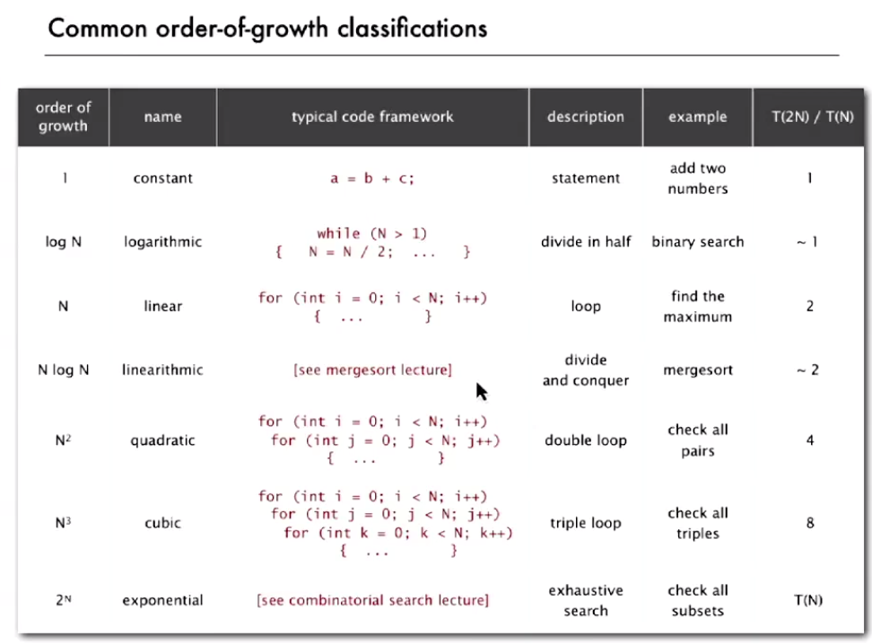

[//]: # (#algorithm)

## order of groth


## computation complexity
1. lower bound: complexity of the problem itself at the worst case
2. upper bound: complexity of the algorithm to solve the problem at the worst case


## union find
1. union find is an algorithm that test if two element is belonged to the same connected component
2. The gist is : if two elements both have the same root, they are connected
3. The ideal model is to have all the elements with in a connected components all directly connected to the its root

## sort(total(arr) = N)
1. selection sort: N iterations, in ith iteration, find the minimum value after index i, swap that with ith element. O(1/2 N^2)
2. insertion sort: O(1/2 N^2) at most
```cpp
for(int i = 0; i < N; i++){
    for(j = i +1 ;j > 0 and arr[j] < arr[j-]; j--){
        swap(arr[j], arr[j-1])
    }
}
```
3. Shellsort or h-sort: an augmented version insertion sort
```cpp
    // initialize stride
    size_t h = 1;
    while(h<N/3) h = 3*h+1;
    while(h>0){
        // elements before index h will be sorted by the next run of smaller h
        for(int i = h; i < N; i++){
            for(int j = i +1 ;j > 0 and arr[j] < arr[j-h]; j-=h){
                swap(arr[j], arr[j-h])
            }
        }
        h /= 3;
    }
```
3. merge sort: merge sort is a divide and conquer problem, it takes O(NlgN) time complexity, which is optimal time, but it needs to allicate new memory equal to its size and recursion is also required.
```cpp
auto mergeSort_step = [](size_t arr[], size_t sz, std::vector<size_t>& aux){
        aux.clear();
        std::string temp;
        for(size_t i=0, j= sz / 2; aux.size() != sz;){
            if(j == sz){
                aux.push_back(arr[i]);
                i++;
            }else if(i == sz/2){
                aux.push_back(arr[j]);
                j++;
            }else if(arr[j]<arr[i]) {
                aux.push_back(arr[j]);
                j++;
            }else {
                aux.push_back(arr[i]);
                i++;
            }
        }
        for (size_t i = 0; i < sz; i++) {
            arr[i] = aux[i];
        }
    };

```
4. bottom-up merge sort
```cpp
    auto bottomUP_mergeSort = [&](std::vector<size_t>& arr){
        std::vector<size_t> aux; aux.reserve(arr.size());
        for(size_t n=1; n+n<=arr.size(); n += n){
            for(size_t segmentStart=0; segmentStart<arr.size(); segmentStart+=2*n){
                mergeSort_step(&(arr[segmentStart]), n + n, aux);
            }
        }
        for (const auto &ele : arr) {
            std::cout<<ele<<' ';
        }
    };
```

5. quick sort: the fastest sort
```cpp

```

## stable sort
1. e.g. if students are first sorted by GPA when Jone and Kate has the same and Jone being at the front of Kate. Next we sort the students by weights, if the second sort algorithm is stable, Jone will definitely remain at the front of Kate **relatively**.