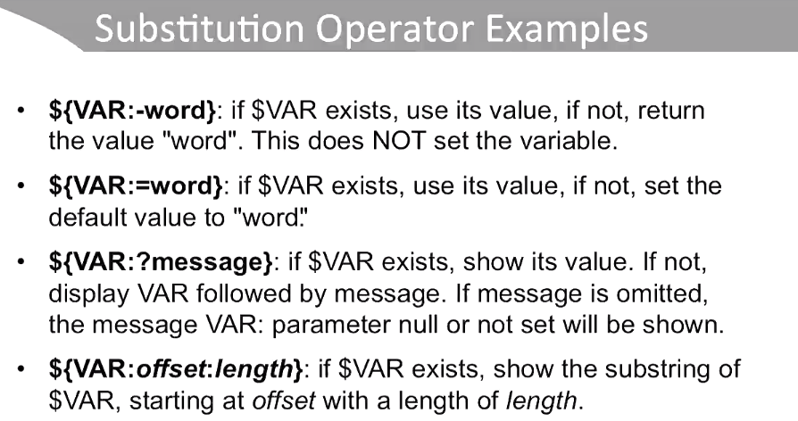
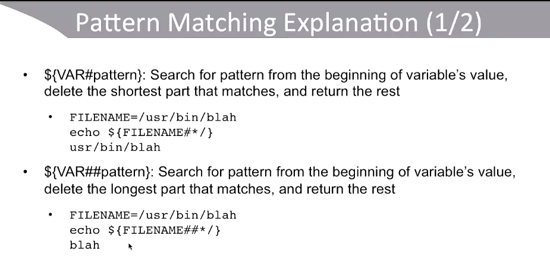
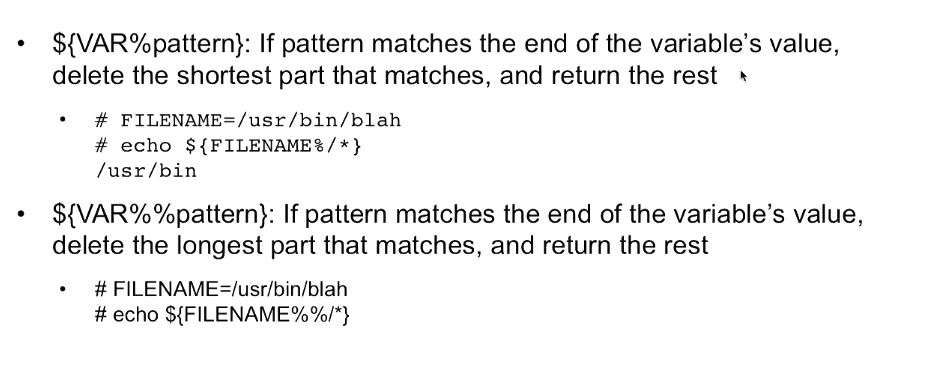
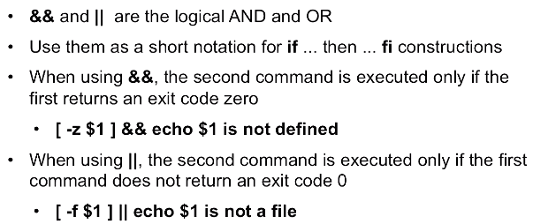
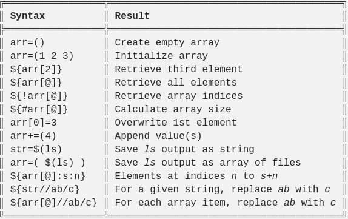

[//]: # (#bash )
## variables and arguments

### How to define variables
1. static assignment
```bash
HELLO='how are you'
```
- This will only persists in current bashshell, not the sub shell

2. export
```bash
export HELLO='how are you'
```
- This will persists also in the sub shell

3. **read** in bashscript
```bash
read HELLO
echo $HELLO
```
- This will block the script process and wait for a usr input

### Extracting from variables
1. $1, $2 ...
- Extract fixed-position arguments from within bash script

2. using **for** with **list**
- using $@ to extract the list of script arguments
```bash
for i in $@
do
	echo i
done
```
- using $# to get the number of script arguments

3. shift
- shift will pop $1
```bash
echo $1
shift 
echo $1 #You are actully referring to the the previous $2
```

### Command substitution
1. using the result of other program
```bash
touch hello-$(date +%d-%m) #touch hello-13-12
```
### Bash shebang
```bash
#!/bin/bash
```
### Exit status
```bash
$?
```

### Here document
1. execute command silently in a row
2. format multiple-line message

### Substitution operator[:link:](https://learning.oreilly.com/videos/bash-scripting-fundamentals/9780134541730/9780134541730-BSHF_03_01)


### Pattern matching operator[:link:](https://learning.oreilly.com/videos/bash-scripting-fundamentals/9780134541730/9780134541730-BSHF_03_01)



### Calculations[:link:](https://learning.oreilly.com/videos/bash-scripting-fundamentals/9780134541730/9780134541730-BSHF_03_04)
1. Internal calculation
```bash
out_var=$((1+1))
```
2. Using external program **bc**

### Conditional statements
```bash
if test_command
then
    command 1
elif
    command 2
else
    command 3
fi
```
- [test_commands](https://www.computerhope.com/unix/test.htm)

### Using && and ||
- _Ture_ is interpreted as **exit success**



### For statement
1. This will print every line in somefile
```bash
for i in $(cat somefile)
do
    echo $i
done
```
2. This will print from 200 to 210
```bash
for i in {200..210}
do
    echo $i
done
```
**If the boundary is not a constant, use this:**
```bash
for i in $( seq 0 $length )
```
or c-style loop
```bash
for (( i = 0; i <= $length; i++ )) 
do 
       echo "do something right $i"
done
```
3. This will count everything within the current directory
```bash
COUNT=0
for i in *
do
    COUNT=$((COUNT+1))
done
echo "Current directory has $COUNT files"
```

### dismiss standard output
```bash
ping -c 192.168.0.100 > /dev/null
```
### dismiss standard error
```bash
ping -c 192.168.0.100 2> /dev/null
```

### case statement
```bash
VAR=$1
case $VAR in 
1|2|3)
    echo "$VAR is within 1-3";;
a|b|c)
    echo "$VAR is within a-c";;
*)
    echo "$VAR is not within 1-3 or a-c";;
esac
```

### While and until
```bash
[while|until] command_0
do
    command_1
done
```

### Options[:link:](https://learning.oreilly.com/videos/bash-scripting-fundamentals/9780134541730/9780134541730-BSHF_06_01)
```bash
#!/bin/bash
while getopts "abc:" opt #a and b are just switches and c shoud follow by an argument
do
case $opt in
    a) VAR1=-m ;;
    b) VAR2="-g 100" ;;
    c) VAR3="-s $OPTARG" ;;
    *) echo 'usage: makeusr [-a] [-b] [-c shell] usrname' && exit 1
esac
done

echo the current arguments are set to $*
shift $((OPTIND -1)) #get rid off all the option-related arguments, this works because they are all in the front
echo now the arguments are set to $*
echo "usradd $VAR1 $VAR2 $VAR3 $1"
exit 0
```

### Function
1. Defining a function
```bash
hello ()
{
    echo hello
}
```
2. Using a function
```bash
hello
```

### Array
1. Cheat sheet
- 
```bash
names=(Linda Lisa Laura)
names[3]=Hello
echo ${names[2]}
echo ${names[@]} #print the whole array
echo ${#names[@]} #print the size of the array
```

### Defining menu interface
1. This will continue for any none empty input
```bash
#!/bin/bash
echo 'Select a directory: '
select DIR in /bin /usr /etc
do
    if [ -n $DIR ]
    then
        echo you have selected $DIR
        export DIR
        break #a break must be provided to end select loops
    else
        echo invalid choice
    fi
done
```
2. This will only continue for leagal input
```bash
#!/bin/bash
echo 'Select a directory: '
select DIR in /bin /usr /etc
do
    case $REPLY in
        1) echo selected $DIR;break;;
        2) echo selected $DIR;break;;
        3) echo selected $DIR;break;;
        *) echo 1 2 or 3 only
    esac
done
```
