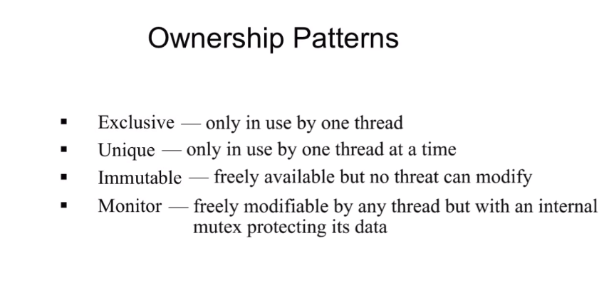

[//]: # (#multithreading #std::ref)
# Multithreading Program in c++
1. std::thread semantics
- std::thread is not aware of whether the worker funcion accepts reference. If std::ref is not used, it will always make an interanl copy.[:link:](https://www.bogotobogo.com/cplusplus/multithreaded4_cplusplus11.php)
```cpp
void updateWidgetData(Widget w, WidgetData& wData);

void fnc4(Widget w)
{
       WidgetData data;
       //std::thread t(updateWidgetData, w, data); //This will copy the passed 'data'
       std::thread t(updateWidgetData, w, std::ref(data));
       displayStatus();
       t.join();
       processWidgetData(data);
}
```
- While temporary object will just be transferred in coherence to move semantics
2. std::promise
- promise is the sender, future is the receiver
- [promise can send back exceptions from child thread](/home/afterburner/markdowns/src/pass_exception_via_promise.md)
3. std::async
- std::async internally wraps up a std::promise a return a std::future
- **Its cost of complexity is paied at compile time!**
- [It can also send back an exception](/home/afterburner/markdowns/src/pass_exception_via_async.md)
4. Ownership patterns


# Best practices and trouble shooting
1. **Problem**: Lost wakeup and spurious wakeup
- The signal before any thread waiting for that will be lost and cause the threads to wait forever
- Some threads maybe unintentionaly woke up **out of no reason!**
  - [Don't wait without a predicate](http://www.modernescpp.com/index.php/condition-variables)
1. **Problem**: Dead locks
- *Description: If it is possible for one thread to get more than one lock, another thread may try to get the same lock in the opposite order*
  - Try to never hold more than one lock at a time.
  - Release any held locks as soon as you can.
  - Never hold a lock any longer than is absolutely necessary.
  - When holding multiple locks, always have the same ordering.
3. **Problem**: Data races
- More than one thread accessing the same memory location
- Without syncronization
- At least one of them is writing
  - Never write to an unlocked, non-atomic, shared resource
  - Never read from an unlocked, non-atomic, shared resource
4. For longer waiting use *condition_variable* or *timer* instead of *mutex*
5. **Don't ever** use weak atomic variables, because they will break sequential assumptions.
- Sequential assumption stands as long as there is no data race.
6. Using strong atimic variables usually ends up using more sophisticated protocals than that of using mutexes