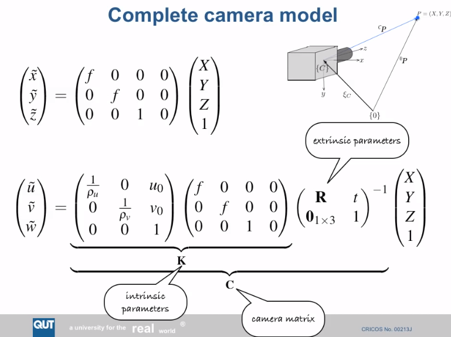
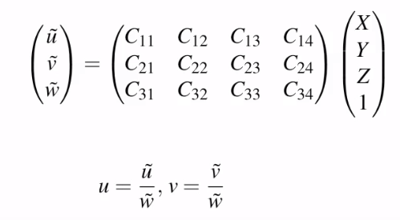
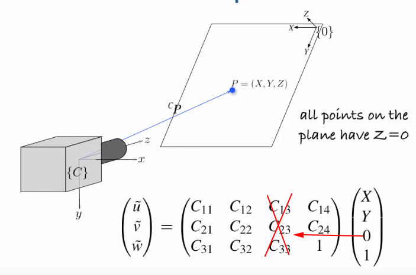
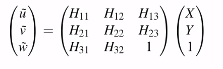

[//]: # (#sfm #structure from motion)
## Intrinsic Parameters
1. What
- Intrinsic parameters is part of the *Homographic matrix*
- It describes the attributes only relate to the camera itself when **a flawless pin-hole camera model is assumed**
- 
- The first matrix describes width and height of image pixels and origin offset from image center
- The second matrix describes only focal length
- The extrinsic matrix describes the orientation and position of the camera sits in the real world

2. Homography matrix
- Ultimatly Homography is the matrix preject 3D world into 2D world => a 3x4 matrix
- 
- For convenience, we always assume the real-world plane sits at Z=0
- 
- Then the homography matrix is only left with 8 unknown parameters
- 

## Essential Matrix and Fundamental Matrix
1. Essential Matrix: The essential matrix gives us an epipolar constraint over all pairs of points between camera L and camera R that converge at a real 3D point[:link:](https://learning.oreilly.com/library/view/mastering-opencv-4/9781789533576/7b99ba68-203b-47c5-a424-d0a8c0b856e0.xhtml)
- Assumption: The intrinsic matrix of both camera is *I*. Not realistic.
2. Fundamental Matrix: The realistic version of *Essential Matrix* that takes into account of the real Intrinsic Matrix. Namely, real pixel size and real focal length